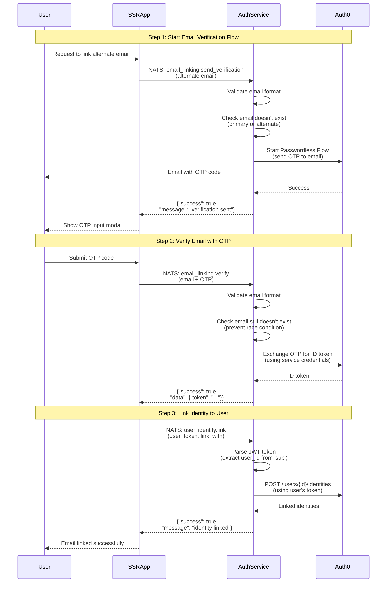

# LFX v2 Auth Service

A NATS-based authentication and user management microservice for the LFX v2 platform. This service provides an abstraction layer between applications and identity providers (Auth0 and Authelia).

## Overview

The LFX v2 Auth Service provides authentication and profile access in the v2 Platform, serving as an abstraction layer between applications and identity providers (Auth0 and Authelia). This service enables user management, profile updates, email/social account linking, and user discovery while maintaining compatibility across different deployment environments.

The service operates as a NATS-based microservice, responding to request/reply patterns on specific subjects.

### Prerequisites
- Go 1.24.5+
- NATS server
- Auth0 configuration (optional, defaults to mock mode)
- Kubernetes cluster (for local Authelia development setup)

### Local Development Support

The auth-service supports **Authelia + NATS KV** integration for local development environments. This setup provides:

- **Authelia** as a local identity provider running in Kubernetes
- **NATS Key-Value store** for persistent user data storage
- **Automatic synchronization** between NATS KV and Authelia's ConfigMap/Secrets
- **DaemonSet restart capability** when user data changes require Authelia pod restarts

For detailed information about the Authelia integration architecture and sync mechanisms, see: [`internal/infrastructure/authelia`](internal/infrastructure/authelia)


### Installation

```bash
├── .github/                        # Github files
│   └── workflows/                  # Github Action workflow files
├── charts/                         # Helm charts for running the service in kubernetes
├── cmd/                            # Services (main packages)
│   └── server/                     # Auth service code
├── internal/                       # Internal service packages
│   ├── domain/                     # Domain logic layer (business logic)
│   │   ├── model/                  # Domain models and entities
│   │   └── port/                   # Repository and service interfaces
│   ├── service/                    # Service logic layer (use cases)
│   └── infrastructure/             # Infrastructure layer
├── pkg/                            # Shared packages
│   ├── constants/                  # Application constants
│   ├── converters/                 # Data conversion utilities
│   ├── errors/                     # Error handling utilities
│   ├── httpclient/                 # HTTP client utilities
│   └── log/                        # Logging utilities
└── README.md                       # This documentation
```

## Usage

### NATS Request/Reply Pattern

The LFX v2 Auth Service operates as a NATS-based microservice that responds to request/reply patterns on specific subjects. The service provides user management capabilities through NATS messaging.

### Available Operations

The service provides the following groups of operations:

#### Email Lookup Operations
Look up users by their email addresses to retrieve usernames or subject identifiers.

**Subjects:**
- `lfx.auth-service.email_to_username` - Look up username by email
- `lfx.auth-service.email_to_sub` - Look up subject identifier by email

**[View Email Lookup Documentation](docs/email_lookups.md)**

---

#### User Metadata Operations
Retrieve and update user profile metadata using various input types (JWT tokens, subject identifiers, or usernames).

**Subjects:**
- `lfx.auth-service.user_metadata.read` - Retrieve user metadata
- `lfx.auth-service.user_metadata.update` - Update user profile

**[View User Metadata Documentation](docs/user_metadata.md)**

---

#### Email Verification Flow
Two-step verification flow for verifying ownership of alternate email addresses.

**Subjects:**
- `lfx.auth-service.email_linking.send_verification` - Send OTP to email
- `lfx.auth-service.email_linking.verify` - Verify email with OTP

📖 **[View Email Verification Documentation](docs/email_verification.md)**

---

#### Identity Linking
Link verified identities (such as verified email addresses) to user accounts.

**Subjects:**
- `lfx.auth-service.user_identity.link` - Link verified identity to user

**[View Identity Linking Documentation](docs/identity_linking.md)**

---

### Email Verification and Linking Flow

The following diagram shows the complete three-step flow for verifying an alternate email address and linking it to a user account:



**Flow Steps:**
- **Step 1-2:** Email verification process - see [Email Verification Documentation](docs/email_verification.md)
- **Step 3:** Identity linking - see [Identity Linking Documentation](docs/identity_linking.md)

---

### Configuration

##### NATS Configuration

The NATS client can be configured using environment variables:

- `NATS_URL`: NATS server URL (default: `nats://localhost:4222`)
- `NATS_TIMEOUT`: Request timeout duration (default: `10s`)
- `NATS_MAX_RECONNECT`: Maximum reconnection attempts (default: `3`)
- `NATS_RECONNECT_WAIT`: Time between reconnection attempts (default: `2s`)

##### Auth0 Configuration

The Auth0 integration can be configured using environment variables:

- `USER_REPOSITORY_TYPE`: Set to `"auth0"` to use Auth0 integration, or `"mock"` for local development
  - **If not set, defaults to `"mock"`**
- `AUTH0_TENANT`: Auth0 tenant name (e.g., `"linuxfoundation"`, `"linuxfoundation-staging"`, `"linuxfoundation-dev"`)
  - **Required when using Auth0 repository type**
- `AUTH0_DOMAIN`: Auth0 domain for Management API calls (e.g., `"sso.linuxfoundation.org"`)
  - **If not set, defaults to `${AUTH0_TENANT}.auth0.com`**
- `AUTH0_CLIENT_ID`: Auth0 Machine-to-Machine application client ID
  - **Required when using Auth0 repository type**
- `AUTH0_PRIVATE_BASE64_KEY`: Base64-encoded private key for Auth0 M2M authentication
  - **Required when using Auth0 repository type**
- `AUTH0_AUDIENCE`: Auth0 API audience/identifier for the Management API
  - **Required when using Auth0 repository type**

## Releases

### Creating a Release

To create a new release of the auth service:

1. **Update the chart version** in `charts/lfx-v2-auth-service/Chart.yaml` prior to any project releases, or if any
   change is made to the chart manifests or configuration:
   ```yaml
   version: 0.2.0  # Increment this version
   appVersion: "latest"  # Keep this as "latest"
   ```

2. **After the pull request is merged**, create a GitHub release and choose the
   option for GitHub to also tag the repository. The tag must follow the format
   `v{version}` (e.g., `v0.2.0`). This tag does _not_ have to match the chart
   version: it is the version for the project release, which will dynamically
   update the `appVersion` in the released chart.

3. **The GitHub Actions workflow will automatically**:
   - Build and publish the container images (auth-service)
   - Package and publish the Helm chart to GitHub Pages
   - Publish the chart to GitHub Container Registry (GHCR)
   - Sign the chart with Cosign
   - Generate SLSA provenance

### Important Notes

- The `appVersion` in `Chart.yaml` should always remain `"latest"` in the committed code.
- During the release process, the `ko-build-tag.yaml` workflow automatically overrides the `appVersion` with the actual tag version (e.g., `v0.2.0` becomes `0.2.0`).
- Only update the chart `version` field when making releases - this represents the Helm chart version.
- The container image tags are automatically managed by the consolidated CI/CD pipeline using the git tag.
- Both container images (auth-service) and the Helm chart are published together in a single workflow.

## Development

To contribute to this repository:

1. Fork the repository
2. Commit your changes to a feature branch in your fork. Ensure your commits
   are signed with the [Developer Certificate of Origin
   (DCO)](https://developercertificate.org/).
   You can use the `git commit -s` command to sign your commits.
3. Ensure the chart version in `charts/lfx-v2-auth-service/Chart.yaml` has been
   updated following semantic version conventions if you are making changes to the chart.
4. Submit your pull request

## License

Copyright The Linux Foundation and each contributor to LFX.

This project’s source code is licensed under the MIT License. A copy of the
license is available in `LICENSE`.

This project’s documentation is licensed under the Creative Commons Attribution
4.0 International License \(CC-BY-4.0\). A copy of the license is available in
`LICENSE-docs`.