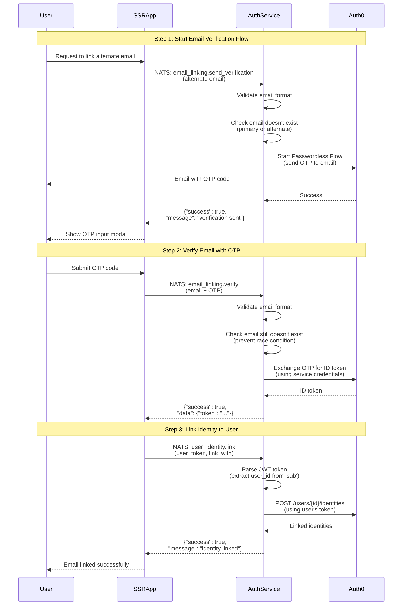

# Email Verification Flow

The auth service provides a two-step verification flow for verifying ownership of alternate email addresses. This flow validates that the user controls the email address and provides an ID token that can be used for identity linking.

## Complete Email Verification and Linking Flow

The following diagram shows the complete three-step flow for verifying an alternate email address and linking it to a user account:



**Flow Steps:**
- **Step 1-2:** Email verification process (documented below)
- **Step 3:** Identity linking - see [Identity Linking Documentation](identity_linking.md)

---

## Step 1: Send Verification Code

To initiate the email verification process, send a NATS request to start the passwordless flow:

**Subject:** `lfx.auth-service.email_linking.send_verification`  
**Pattern:** Request/Reply

### Request Payload

The request payload should be a plain text email address (no JSON wrapping required):

```
alternate-email@example.com
```

### Reply

The service sends a one-time password (OTP) to the provided email address and returns a success confirmation:

**Success Reply:**
```json
{
  "success": true,
  "message": "alternate email verification sent"
}
```

**Error Reply (Email Already Linked):**
```json
{
  "success": false,
  "error": "alternate email already linked"
}
```

**Error Reply (Invalid Email):**
```json
{
  "success": false,
  "error": "alternate email is required"
}
```

### Example using NATS CLI

```bash
# Send verification code to alternate email
nats request lfx.auth-service.email_linking.send_verification "john.personal@gmail.com"

# Expected response: {"success":true,"message":"alternate email verification sent"}
```

**Important Notes:**
- The service checks if the email is already linked to any user account before sending the verification code
- An OTP code is available to be used for a valid time period

---

## Step 2: Verify Email with OTP

After receiving the OTP code via email, verify the email address by exchanging the OTP for authentication tokens:

**Subject:** `lfx.auth-service.email_linking.verify`  
**Pattern:** Request/Reply

### Request Payload

The request payload must be a JSON object containing the email address and the OTP code:

```json
{
  "email": "john.personal@gmail.com",
  "otp": "123456"
}
```

### Required Fields

- `email`: The email address that received the verification code
- `otp`: The one-time password code sent to the email

### Reply

The service validates the OTP and returns authentication tokens if successful:

**Success Reply:**
```json
{
  "success": true,
  "data": {
    "token": "eyJhbGciOiJSUzI1NiIsInR5cCI6IkpXVCJ9..."
  }
}
```

The returned token is an authentication token that can be used to link the verified email to the user's account.

**Error Reply (Invalid OTP):**
```json
{
  "success": false,
  "error": "failed to exchange OTP for token"
}
```

**Error Reply (Email Already Linked):**
```json
{
  "success": false,
  "error": "alternate email already linked"
}
```

**Error Reply (Invalid Request):**
```json
{
  "success": false,
  "error": "failed to unmarshal email data"
}
```

### Example using NATS CLI

```bash
# Verify the alternate email with OTP code
nats request lfx.auth-service.email_linking.verify '{
  "email": "john.personal@gmail.com",
  "otp": "123456"
}'

# Expected response: {"success":true,"data":{"token":"eyJhbG..."}}
```

**Important Notes:**
- This feature is **only supported for Auth0**. Authelia and mock implementations do not support this functionality yet.
- OTP codes are time-sensitive and available for a valid time period
- The service prevents linking an email that is already verified and linked to another user
- The returned token (ID token) can be used to link the verified email to the user account using the identity linking operation (see [Identity Linking Documentation](identity_linking.md))
- For detailed Auth0-specific implementation details and technical information about the passwordless flow, see: [`../internal/infrastructure/auth0/README.md`](../internal/infrastructure/auth0/README.md)


