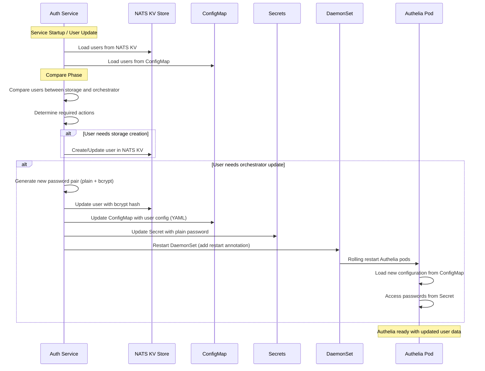

# Authelia Integration

This package provides integration between the LFX v2 Auth Service and Authelia, a modern authentication and authorization server. The integration enables local development environments to use Authelia as an identity provider while maintaining user data persistence through NATS Key-Value store.

## Architecture Overview

The Authelia integration consists of several key components:

- **NATS KV Storage**: Persistent storage for user data using NATS Key-Value store
- **Kubernetes Orchestrator**: Manages Authelia ConfigMaps, Secrets, and DaemonSet restarts
- **Sync Engine**: Synchronizes user data between NATS KV and Authelia's Kubernetes resources (currently runs only at auth-service startup; future versions will watch for NATS KV changes)

## Components

### Storage Layer (`storage.go`)
- Implements NATS Key-Value store for persistent user data
- Provides CRUD operations for Authelia user records
- Maintains user data in JSON format within NATS KV buckets

### Orchestrator Layer (`orchestrator.go`)
- Manages Kubernetes resources (ConfigMaps, Secrets, DaemonSets)
- Updates Authelia configuration when user data changes
- Handles DaemonSet restarts to apply configuration changes

### Sync Engine (`sync.go`)
- Compares user data between NATS KV storage and Kubernetes ConfigMaps
- Determines required actions (create, update, or no action needed)
- Orchestrates updates to maintain consistency between storage and runtime configuration

### User Management (`user.go`)
- Provides high-level user operations (get, update, search)
- Integrates with the sync engine to ensure data consistency
- Implements the domain port interfaces for user management

## Sync Flow

The synchronization process ensures that user data stored in NATS KV is properly reflected in Authelia's runtime configuration:

1. **Load Phase**: Retrieves user data from both NATS KV storage and Kubernetes ConfigMaps
2. **Compare Phase**: Identifies differences between storage and orchestrator data
3. **Sync Phase**: Updates storage and/or orchestrator based on identified differences
4. **Restart Phase**: Restarts Authelia DaemonSet when configuration changes are made

### Sequence Diagram

The following sequence diagram illustrates the synchronization process between NATS KV storage and Authelia's Kubernetes resources:



### Sync Actions

- **Storage Creation**: User exists in orchestrator but not in storage - user is added to NATS KV
- **Orchestrator Creation**: User exists in storage but not in orchestrator - ConfigMap and Secrets are updated
- **Orchestrator Update**: User exists in both but has different password or email - ConfigMap and Secrets are updated
- **No Action**: User data is consistent between storage and orchestrator

## Configuration

The Authelia integration requires the following configuration parameters:

### Kubernetes Configuration
- `namespace`: Kubernetes namespace where Authelia resources are deployed
- `configmap-name`: Name of the ConfigMap containing Authelia user configuration
- `daemon-set-name`: Name of the Authelia DaemonSet to restart when needed
- `secret-name`: Name of the Secret containing user passwords

### NATS Configuration
- NATS server connection details (inherited from main service configuration)
- Key-Value bucket configuration for user data storage

## Subject Identifier (SUB) Management

### SUB Generation and Persistence

The Subject Identifier (SUB) in Authelia is a deterministic UUID that uniquely identifies each user within the system. Key characteristics:

- **Deterministic Generation**: The SUB is a UUID that is consistently generated for each user by Authelia
- **Token-Based Persistence**: To ensure consistent data retrieval from Authelia, the SUB is only persisted when a user is updated using a valid authentication token
- **OIDC UserInfo Endpoint**: The SUB can be retrieved from Authelia's OIDC UserInfo endpoint at `/api/oidc/userinfo` using a valid token

### Token-Based User Updates

When updating user metadata through the auth service, the SUB is populated by accessing Authelia's UserInfo endpoint with the provided token:

```bash
# Example: Update user metadata with token (this populates the SUB)
nats req --server nats://lfx-platform-nats.lfx.svc.cluster.local:4222 "lfx.auth-service.user_metadata.update" '{
  "token": "authelia_at_Tx****",
  "user_metadata": {
    "city": "Metropolis"
  }
}'
```

This process ensures that:
- The SUB is retrieved from Authelia's authoritative source
- User data consistency is maintained across the system
- The canonical user identifier is properly established for future lookups

## Security Considerations

- User passwords are automatically generated and stored as bcrypt hashes in ConfigMaps
- Plain text passwords are stored separately in Kubernetes Secrets for Authelia access
- All password generation uses cryptographically secure random generation
- Kubernetes RBAC controls access to ConfigMaps and Secrets

## Development Usage

When running in local development mode with Authelia:

1. Ensure Kubernetes cluster is available (local or remote)
2. Deploy Authelia using the LFX v2 platform Helm charts: [lfx-v2-helm/charts/lfx-platform/templates/authelia](https://github.com/linuxfoundation/lfx-v2-helm/tree/main/charts/lfx-platform/templates/authelia)
3. Configure the auth-service with proper Kubernetes credentials and resource names
4. The service will automatically sync user data and restart Authelia when needed

## Error Handling

The integration includes comprehensive error handling for:
- Kubernetes API failures
- NATS KV storage issues
- Configuration validation errors
- Sync operation failures

All errors are logged with appropriate context and returned as structured error types for proper handling by the calling application.
